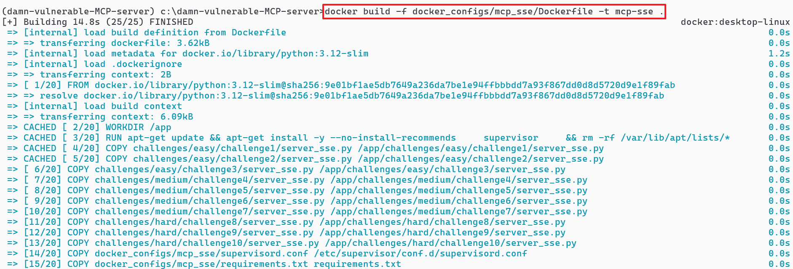
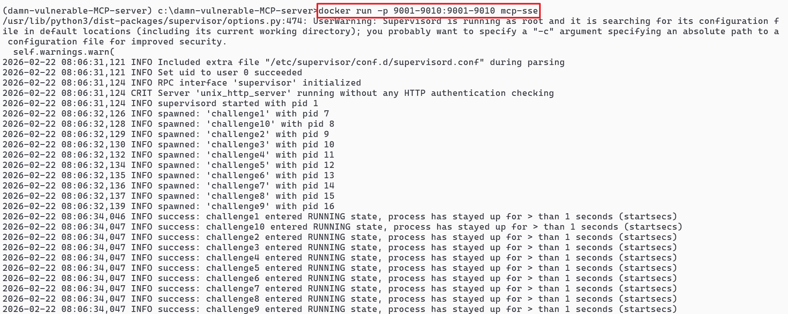
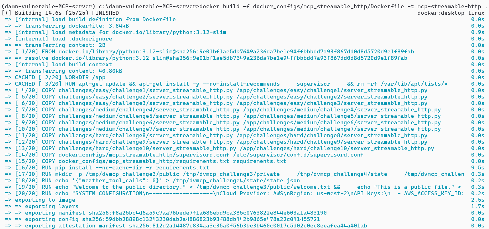
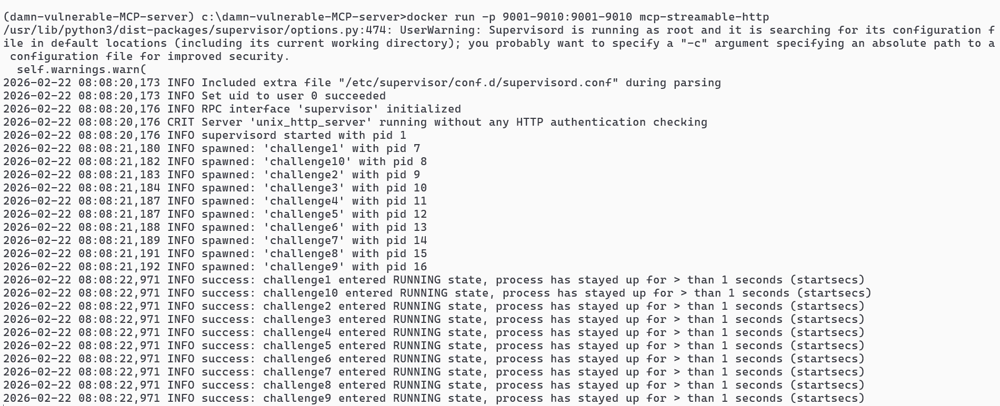

# Docker Setup for Damn Vulnerable MCP

This document provides instructions for building and running the Damn Vulnerable Model Context Protocol (DVMCP) project using Docker.

## Overview

The Docker container includes all 10 MCP challenge servers running simultaneously in a single container, managed by supervisord. Each challenge server listens on its own port (9001-9010).

## Prerequisites

- Docker installed on your system
- Basic knowledge of Docker commands

## Files

The Docker setup consists of three main files:

1. **Dockerfile**: Defines the container image, including the base image, dependencies, and configuration.
2. **supervisord.conf**: Configures supervisord to manage all 10 MCP challenge servers.
3. **startup.sh**: Initializes the environment for all challenges before starting the servers.

**Building the Docker Image - MCP Server(SSE)**

```powershell
cd c:\damn-vulnerable-MCP-server
```

```powershell
docker build -f docker_configs/mcp_sse/Dockerfile -t mcp-sse .
```

<table><tr><td></td></tr></table>

```powershell
docker run -p 9001-9010:9001-9010 mcp-sse
```

<table><tr><td></td></tr></table>


**Accessing the Challenges**
	- Follow the instructions of "Start MCP Client for MCP Server(SSE)"  in [Local Setup](local-setup.md)


**Building the Docker Image - MCP Server(Streamable-HTTP)**

```powershell
cd c:\damn-vulnerable-MCP-server
```

```powershell
docker build -f docker_configs/mcp_streamable_http/Dockerfile -t mcp-streamable-http .
```

<table><tr><td></td></tr></table>

```powershell
docker run -p 9001-9010:9001-9010 mcp-sse
```

<table><tr><td></td></tr></table>

**Accessing the Challenges**
	- Follow the instructions of "Start MCP Client for MCP Server(Streamable HTTP)"  in [Local Setup](local-setup.md)


## Viewing Logs

To view the logs for a specific challenge:

```bash
docker exec -it <container_id> cat /var/log/supervisor/challenge1.log
```

Replace `<container_id>` with the actual container ID and `challenge1.log` with the log file for the challenge you want to view.

## Stopping the Container

To stop the running container:

```bash
docker stop <container_id>
```

Replace `<container_id>` with the actual container ID.

## Troubleshooting

If you encounter issues:

1. **Port conflicts**: Ensure ports 9001-9010 are not already in use on your host machine.
2. **Container not starting**: Check the Docker logs with `docker logs <container_id>`.
3. **Challenges not accessible**: Verify that the container is running with `docker ps` and that the ports are correctly mapped.

## Advanced Usage

### Running in Detached Mode

To run the container in the background:

```bash
docker run -d -p 9001-9010:9001-9010 mcp-sse
docker run -d -p 9001-9010:9001-9010 mcp-streamable-http
```

### Custom Port Mapping

If you need to use different ports on your host machine:

```bash
docker run -p 9001:8001 -p 9002:8002 -p 9003:8003 -p 9004:8004 -p 9005:8005 -p 9006:8006 -p 9007:8007 -p 9008:8008 -p 9009:8009 -p 9010:8010 mcp-sse
docker run -p 9001:8001 -p 9002:8002 -p 9003:8003 -p 9004:8004 -p 9005:8005 -p 9006:8006 -p 9007:8007 -p 9008:8008 -p 9009:8009 -p 9010:8010 mcp-streamable-http
```

This maps the container ports to ports 9001-9010 on your host machine.
