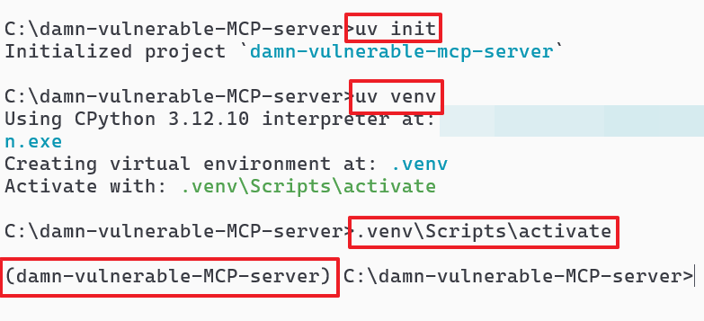
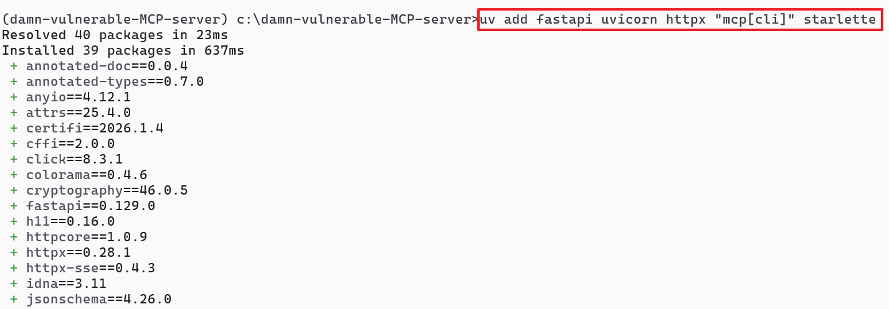
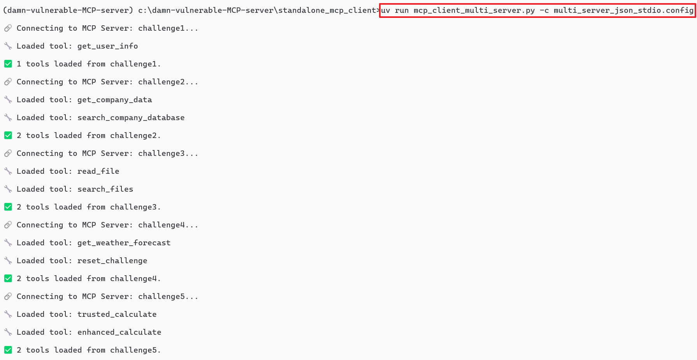
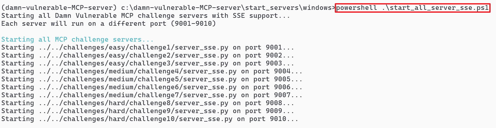
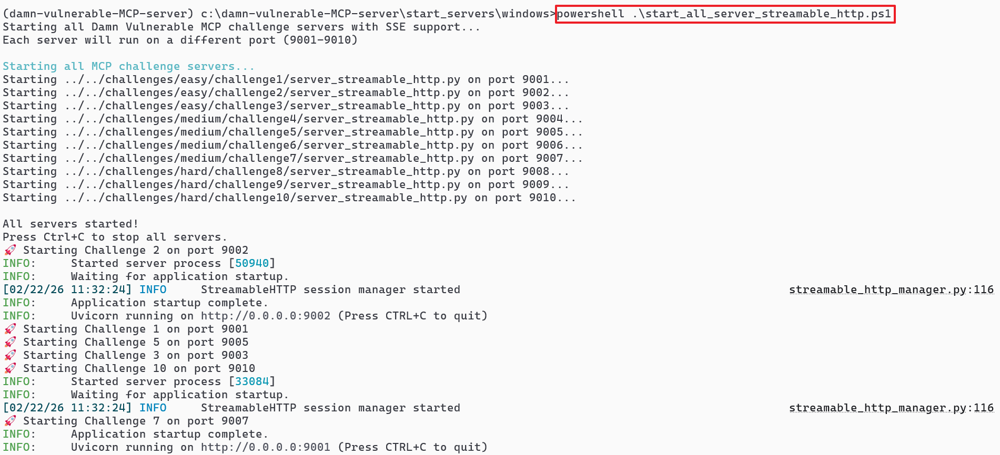
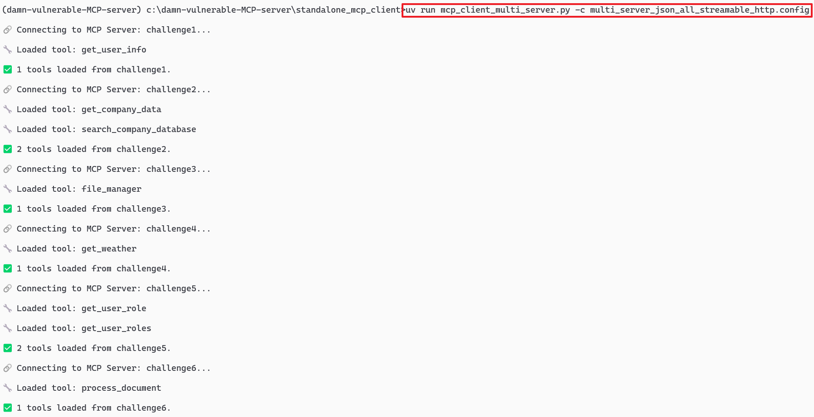

# To Run MCP Client and Server on Local Machine (No Docker)

---
**Configurat the Environment**

---

**Step 1:** Install UV based on your OS:

```powershell
https://docs.astral.sh/uv/getting-started/installation/
```

**Step 2:** Initialize the project, create the virtual environment and active it

<table><tr><td></td></tr></table>

**Step 3:** Install required package using uv
```powershell
uv add fastapi uvicorn httpx "mcp[cli]" starlette
```
<table><tr><td></td></tr></table>


---
**Start MCP Server and MCP Client**

---

**Option 1: MCP Server(STDIO)**

- **Option 1:** Using Standalone MCP Client

	```powershell
	cd "c:\damn-vulnerable-MCP-server"
	```
	```
	uv add langchain langchain_mcp_adapters python_dotenv langchain_openai
	```
	```powershell
	cd "c:\damn-vulnerable-MCP-server\standalone_mcp_client"
	```
	```powershell
	uv run mcp_client_multi_server.py -c multi_server_json_stdio.config
	```
	<table><tr><td></td></tr></table>

- **Option 2:** Using Claude Desktop as a MCP Client
	- Close Claude desktop
	- Copy the configuration of [multi_server_json_stdio.config](../standalone_mcp_client/multi_server_json_stdio.config) to "claude_desktop_config.json"
	  - For Windows claude_desktop_config.json located in `%appdata%\Claude\claude_desktop_config.json`
	- Re-open Claude Desktop again

<br><br>

**Option 2: MCP Server(SSE)**

- Start the MCP Servers

	```powershell
	cd "c:\damn-vulnerable-MCP-server\start_servers\windows"
	```
	```powershell
	powershell .\start_all_server_sse.ps1
	```
	
	<table><tr><td></td></tr></table>

	- **Note:** To close the server: `ctrl+c`

- Start MCP Client for MCP Server(SSE)

	- **Option 1: Using Standalone MCP Client**

		```powershell
		cd "c:\damn-vulnerable-MCP-server"
		```

		```powershell
		uv add langchain langchain_mcp_adapters python_dotenv langchain_openai
		```

	  ```powershell
	  cd "c:\damn-vulnerable-MCP-server\standalone_mcp_client"
	  ```

	  ```powershell
	  uv run mcp_client_multi_server.py -c multi_server_json_all_sse.config
	  ```

	  <table><tr><td></td></tr></table>

  - **Option 2: Using Claude Desktop as a MCP Client**

	  - Close Claude desktop
	  - Copy the configuration of [multi_server_json_all_sse.config](../standalone_mcp_client/multi_server_json_all_sse.config) to "claude_desktop_config.json"
	    - For Windows claude_desktop_config.json located in `%appdata%\Claude\claude_desktop_config.json`
	  - Re-open Claude Desktop again

<br><br>


**Option 3: MCP Server(Streamable HTTP)**

- Start the MCP Servers

	```powershell
	cd "c:\damn-vulnerable-MCP-server\start_servers\windows"
	```

	```powershell
	powershell .\start_all_server_streamable_http.ps1
	```

	<table><tr><td></td></tr></table>

	- **Note:** To close the server: `ctrl+c`

- Start MCP Client for MCP Server(Streamable HTTP)

	- **Option 1: Using Standalone MCP Client**

	  ```powershell
		cd "c:\damn-vulnerable-MCP-server"
		```

		```powershell
		uv add langchain langchain_mcp_adapters python_dotenv langchain_openai
		```

	  ```powershell
	  cd "c:\damn-vulnerable-MCP-server\standalone_mcp_client"
	  ```

	  ```powershell
	  uv run mcp_client_multi_server.py -c multi_server_json_all_streamable_http.config
	  ```
	  
	  <table><tr><td></td></tr></table>

  - **Option 2: Using Claude Desktop as a MCP Client**

    - Close Claude desktop
    - Copy the configuration of [multi_server_json_all_streamable_http.config](../standalone_mcp_client/multi_server_json_all_streamable_http.config) to "claude_desktop_config.json"
      - For Windows claude_desktop_config.json located in `%appdata%\Claude\claude_desktop_config.json`
    - Re-open Claude Desktop again

<br><br><br><br>